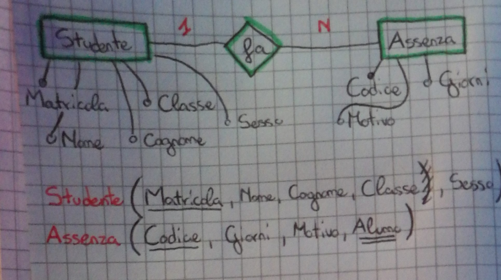

# Esercitazione SQL: Alunno - Assenza

### 1. Diagramma ER & schema LOGICO
 

### 2. Query
&nbsp; **1.** ottenere a fino anno scolastico il conteggi dei giorni di assenza per alunno ordinato per alunno
```SQL
SELECT Studente.Matricola, Studente.nome, Studente.cognome, SUM(Assenza.giorni) AS Giorni
FROM Assenza INNER JOIN Studente ON Matricola = alunno
GROUP BY Studente.Matricola, Studente.nome, Studente.cognome
ORDER BY Studente.nome, Studente.cognome
```

<br>

&nbsp; **2.** individuare gli alunni con numero di assenze superiori a 10
```SQL
SELECT Studente.Matricola, Studente.nome, Studente.cognome, SUM(Assenza.giorni) AS Giorni
FROM Assenza INNER JOIN Studente ON Matricola = alunno
GROUP BY Studente.Matricola, Studente.nome, Studente.cognome
ORDER BY Studente.nome, Studente.cognome
HAVING SUM(Assenza.giorni) > 10
```

<br>

&nbsp; **3.** calcolare il conteggio dei giorni di assenza per motivazioni
```SQL
SELECT Assenza.Motivo, SUM(Assenza.Giorni) AS Giorni
FROM Assenza
GROUP BY Assenza.Motivo
```

<br>

&nbsp; **4.** calcolare il totale generale dei giorni di assenza della scuola
```SQL
SELECT SUM(Assenza.Giorni) AS Assenze_Scuola
FROM Assenza
```

<br>

&nbsp; **5.** calcolare il totale dei giorni di assenza per maschi e femmine

```SQL
SELECT Studente.Sesso, SUM(Assenza.giorni) AS Giorni
FROM Assenza INNER JOIN Studente ON Matricola = alunno
GROUP BY Studente.Sesso
```

<br>

&nbsp; **6.** calcolare il totale dei giorni di assenza per classe 
```SQL
SELECT Alunno.Classe, SUM(Assenza.Giorni) AS Assenze_Classe
FROM Assenza INNER JOIN Alunno ON Matricola = alunno
GROUP BY Alunno.Classe
```
